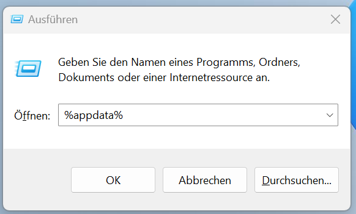
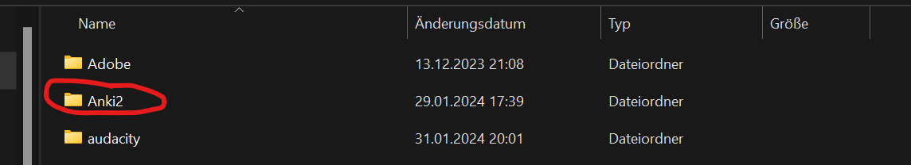
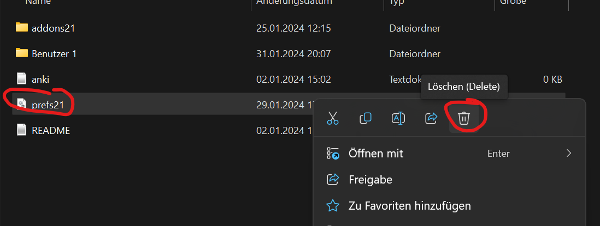
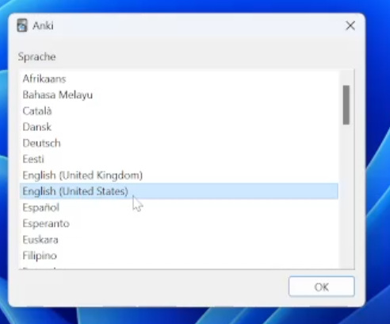
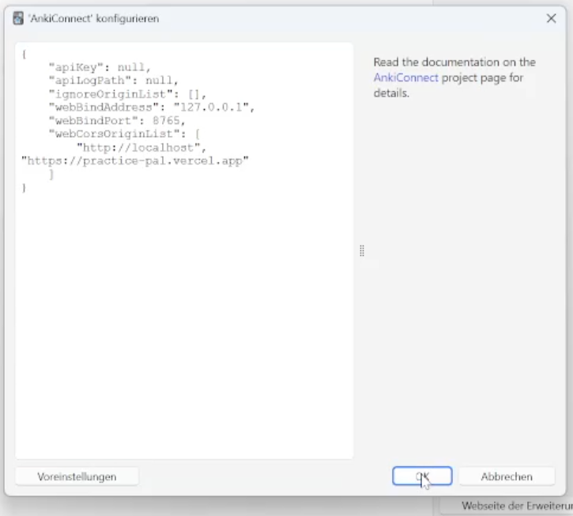

# Practice Pal
## Requirements
- Anki for Windows/Mac/Linux (https://apps.ankiweb.net/)
## Pre-Setup
Only if you used Anki before on this Device, you have to reset all Settings:
1. Press "Win+R", type "%appdata%" and click "OK".

2. Look for the Folder "Anki2" and open it.

3. To reset all Anki settings, look for the File "prefs21" and delete it.
 

## Setup
1. Start Anki, select the language "English (United States)" and confirm. It ist very important to select the language "English (United States)" otherwise it will not work! 
 
Afterwards you can change the language back to "German" the following way: 
- In the Menubar click "Tools" -> "Preferences".
- Under "General" -> "Language" select "Deutsch" and click "OK".
- Restart Anki for the changes to take effect.

2. Install the Anki-Connect plugin: 
- In the Menubar click "Extras" -> "Erweiterungen".
- On the top right side click "Erweiterungen herunterladen...".
- Insert the Code for [Anki-Connect](https://ankiweb.net/shared/info/2055492159) "2055492159" and click "OK".

3. Configure AnkiConnect:
- After AnkiConnect is installed, on the bottom right side click "Konfiguration".
- Add the following URL to the "WebCorsOriginList": "https://practice-pal.vercel.app". It is important to not include the / at the end of the URL. 
 
- Restart Anki for the changes to take effect.

## Usage

